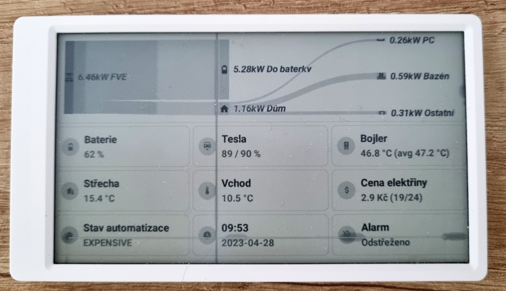

# HomeAssistant2eink

Display homeassistant dashboard on eink display.



## Supported devices

M5Paper only

## How does it work

There is a simple HTTP server that will connect to your HomeAssistant instance. It will run a headless browser
and create a screenshot of your dashboard that will then be displayed on your device.

This is just for displaying the dashboard, no interaction is possible at the moment.

## Installation

1. Create a new user in HomeAssistant
2. (Optional) Create a new dashboard in HomeAssistant
3. Create a `.env` file with following content

```
# Secret for authorization
TOKEN=<SECRET>
# HomeAssistant dashboard URL, something like http://<IP>:<PORT>/dashboard-m5paper/0
HOMEASSISTANT_URL=
# Username of HomeAssistant user created in step 1
HOMEASSISTANT_USERNAME=
# Password of HomeAssistant user created in step 1
HOMEASSISTANT_PASSWORD=
```
4. Create `config.py` file with following content

```
# Name of the wifi
WIFI_SSID = 'YOUR_WIFI'
# Wifi password
WIFI_PASSWORD = 'YOUR_WIFI_PASSWORD'
# URL for your server (this app, not HomeAssistant)
SERVER_URL = 'YOUR_SERVER_URL'
# The same token as in step 3
SERVER_TOKEN = 'YOUR_SHARED_SECRET'
```

5. Run the server

```
docker-compose up -d
```

6. Use M5Burner to upload UIFlow to your M5Paper device

7. Upload the source to M5Paper using UIFlow token (it's visible on your M5Paper, if not hold the button in center position and restart)

```
./upload <TOKEN>
```

Alternatively you can add the token to `.env` as `DEVICE_UIFLOW_TOKEN`

8. The dashboard should appear on your M5Paper in like 10 seconds, if not, connect USB to the device and see the logs

```
picocom -b 115200 /dev/ttyACM0
```
